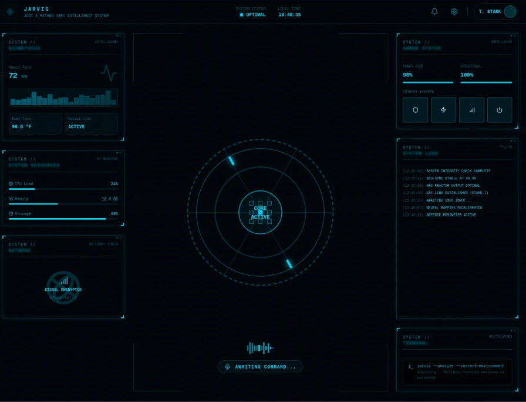

# CONTEXT, ARCHITECTURE AND WORKFLOW FOR AGENTS

This document is to be treated as the final truth about this project.

## Entry Screen - Example

## Sections of the Homepage (entry screen)

- Homepage - A simple UI made with HTML and CSS, and simple Javascript to make it interactive. THREE,js is used to create the middle section of this page. This page is to be the landing page of this Web Application.

- mainarea-left - This is the left side of the Homepage, this has [unfinished]

- mainarea-right - This is the right side of the Homepage, this has [unfinished]

- mainarea-bottom - This is a text box which directly connects with an AI, whether it is a Local Model or a Remote Model connected via an API. 

- mainarea-leftbottom - This is a text box at the bottom of 'mainarea-left' which acts as a wrapper for your selected type of terminal (Bash,CMD,Powershell,WSL,Git Bash,etc.) 

## Style

### THE MIDDLE HOLOGRAM:

#### Here is the breakdown of every hex color code used in the rewritten script:

1. The Power Core (Center Element)

* 0xff3366 (Diagnostic Crimson Red)
* Where it is used: Inside the PointsMaterial object for the coreCloud.
   * Visual Role: Creates the rapid, flashing microscopic quantum cluster right at the dead center of the engine.

2. Inner System Readouts

* 0x00ffcc (Bright Cyan/Teal Mint)
* Where it is used: Inside the MeshBasicMaterial for the triangular/hexagonal coreRing.
   * Visual Role: Drives the ultra-fast processing reticle tracking the red core.

3. Intermediate Tracking Framework

* 0x00f0ff (Stark Hologram Blue)
* Where it is used: Inside the MeshBasicMaterial for both equatorial tracks (track1 and track2).
   * Visual Role: Emulates the dual-axis horizontal baseline stabilizer tracks.

4. Scanning & Telemetry Overlays

* 0x00bcff (Electric Blue)
* Where it is used: Inside the primary off-axis orbital tracking ring (scanningRing1).
   * Visual Role: Provides a darker, richer blue depth layer to mimic complex diagnostic screens.

5. Outer Perimeter Systems

* 0x00aaff (Deep Digital Sky Blue)
* Where it is used: Inside the low-poly HUD perimeter mesh (perimeterCage).
   * Visual Role: Keeps the outer safety boundaries faint and unobtrusive (opacity: 0.08), preventing it from blocking the inner shapes.

6. Background Alpha Mask

* 0x000000 (Pure Black)
* Where it is used: Inside the renderer setup via renderer.setClearColor(0x000000, 0).
   * Visual Role: Establishes a zero-intensity dark void canvas, though the second argument (0) forces it to be fully transparent so your layout's CSS container background shines through.
